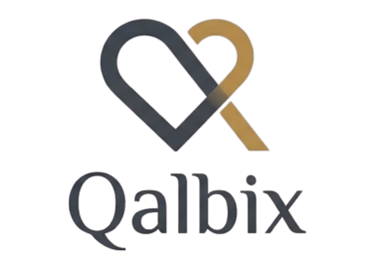

<div align="center">



# Qalbix

### Understand Your Emotions. Strengthen Your Habits. Grow Your Faith.

An AI-powered Islamic emotional coaching and spiritual habit-tracking platform, built for the modern Muslim seeking a deeper connection between their emotional well-being and their Deen.

[](https://react.dev)
[](https://fastapi.tiangolo.com)
[](https://python.org)
[](https://tailwindcss.com)
[](https://vitejs.dev)
[](LICENSE)
[]()
[](https://vercel.com)

---

</div>

## 📋 Overview

Most Islamic apps provide static, one-size-fits-all content — a fixed list of du'as, a Quran reader, a simple prayer tracker. They don't adapt to **how the user actually feels**. Qalbix changes this entirely. It introduces an **emotion-aware, adaptive coaching layer** that understands your emotional state — through direct mood selection or free-text expression — and responds with deeply personalized guidance rooted in the Quran and Sunnah.

Qalbix isn't just a spiritual tool — it's a **behavioral intelligence platform**. The proprietary **Qalbix Emotion Engine** processes natural language to detect mood patterns, while the **Adaptive Habit Grading System** dynamically adjusts expectations based on the user's consistency. If a user is struggling, the system enters *Simplified Mode* — reducing overwhelm and focusing only on core obligations. This isn't gamification; it's compassionate, data-driven spiritual mentorship.

---

## ✨ Core Features

| Feature | Description |
|---|---|
| 🧠 **Qalbix Emotion Engine** | Proprietary AI core that analyzes free-text input or explicit mood selection to detect emotional states (Calm, Stressed, Sad, Angry, Anxious, Grateful, Hopeful) and deliver contextually relevant Islamic guidance. |
| 📖 **Quranic & Hadith Guidance** | Each check-in generates a personalized response containing an authentic Quran verse, a verified Hadith, empathetic acknowledgment, and an actionable spiritual step — all matched to the user's current emotional state. |
| 🎙️ **Native Text-to-Speech** | Built-in Web Speech API integration allows users to listen to Quran verses and Hadith narrations directly from the guidance card with animated audio feedback. |
| 📊 **Adaptive Habit Grading** | A weighted scoring system (Salah 40pt, Quran 25pt, Dhikr 20pt, Reflection 15pt) with automatic grade computation (A/B/C). Detects consecutive low scores and enters *Simplified Mode* to prevent burnout. |
| 📈 **Analytics Dashboard** | 7-day weekly progress chart with gradient-colored bars, grid lines, score labels, interactive tooltips, and summary statistics (Average Score, Best Grade, Active Days). |
| 🌙 **Elegant Dark Mode** | Full class-based dark mode with smooth transitions powered by Framer Motion and Tailwind CSS 4. Every component is designed for both themes. |
| 🔄 **Data Management** | Complete data reset functionality with double-confirmation modal (type "RESET" to confirm) for GDPR-style user data control. |

---

## 🏗️ Architecture & Tech Stack

<table>
<tr>
<td width="50%" valign="top">

### 🖥️ Frontend
| Technology | Purpose |
|---|---|
| **React 19** | Component architecture |
| **Vite 8** | Lightning-fast build tool |
| **Tailwind CSS 4** | Utility-first styling |
| **Framer Motion** | Page transitions & animations |
| **Lucide React** | Professional SVG icon system |
| **Axios** | API communication layer |
| **React Hot Toast** | Notification system |

</td>
<td width="50%" valign="top">

### ⚙️ Backend
| Technology | Purpose |
|---|---|
| **Python 3.10+** | Core runtime |
| **FastAPI** | High-performance async API |
| **SQLAlchemy** | ORM & database layer |
| **SQLite** | Lightweight data storage |
| **Pydantic** | Request/response validation |
| **Uvicorn** | ASGI production server |
| **Qalbix Engine** | Proprietary emotion model |

</td>
</tr>
</table>

---

## 🚀 Quick Start

### Prerequisites

- **Python** 3.10 or higher → [Install](https://python.org/downloads)
- **Node.js** 18 or higher → [Install](https://nodejs.org)
- **Git** → [Install](https://git-scm.com)

### Step 1 — Clone the Repository

```bash
git clone https://github.com/your-org/qalbix.git
cd qalbix
```

### Step 2 — Start the Backend (FastAPI)

Open your first terminal:

```bash
# Navigate to backend
cd backend

# Create & activate virtual environment
python -m venv venv

# Activate (macOS / Linux)
source venv/bin/activate

# Activate (Windows PowerShell)
.\venv\Scripts\Activate.ps1

# Install dependencies
pip install -r requirements.txt

# Configure internal engine environment variables
# Create a .env file with your engine configuration
cp .env.example .env

# Start the API server
uvicorn main:app --reload --port 8000
```

You should see:
```
INFO:     Uvicorn running on http://0.0.0.0:8000
INFO:     Application startup complete.
```

### Step 3 — Start the Frontend (React / Vite)

Open a **new terminal**:

```bash
# Navigate to frontend
cd frontend

# Install dependencies
npm install

# Start the development server
npm run dev
```

You should see:
```
VITE v8.x.x  ready in ~400ms

➜  Local:   http://localhost:5173/
```

### ✅ Done!

Open **http://localhost:5173** in your browser. The frontend automatically proxies API requests to the FastAPI backend on port 8000.

---

## 📁 Project Structure

```
qalbix/
├── backend/
│   ├── main.py              # FastAPI application & API routes
│   ├── models.py             # SQLAlchemy ORM models
│   ├── database.py           # Database engine configuration
│   ├── requirements.txt      # Python dependencies
│   └── .env                  # Engine environment config
│
├── frontend/
│   ├── public/
│   │   ├── logo.png          # Brand logo
│   │   └── images/           # Showcase imagery
│   ├── src/
│   │   ├── App.jsx           # Root layout, router, navbar
│   │   ├── index.css         # Tailwind config & animations
│   │   ├── main.jsx          # React entry point
│   │   └── components/
│   │       ├── Landing.jsx   # Hero, features, CTA sections
│   │       ├── CheckIn.jsx   # Dual-mode emotion check-in
│   │       ├── GuidanceCard.jsx  # AI guidance display + TTS
│   │       ├── Dashboard.jsx # Analytics, habits, weekly chart
│   │       └── Settings.jsx  # Theme, about, data management
│   ├── index.html            # HTML entry with SEO meta
│   ├── vite.config.js        # Vite + Tailwind config
│   └── package.json
│
└── README.md
```

---

## 🔌 API Reference

| Method | Endpoint | Description |
|---|---|---|
| `POST` | `/api/checkin` | Submit an emotional check-in (mood or free-text). Returns AI-generated guidance. |
| `POST` | `/api/habits` | Save daily habit completion. Returns computed score & grade. |
| `GET` | `/api/dashboard/{user_id}` | Retrieve dashboard data: today's habits, weekly logs, recent check-ins, adaptive mode. |
| `GET` | `/api/checkins/{user_id}` | Retrieve last 20 check-in records for a user. |
| `DELETE` | `/api/reset/{user_id}` | Permanently delete all check-in and habit data for a user. |

---

## 🌐 Production Deployment

### Frontend → Vercel

The React frontend is optimized for one-click deployment on [Vercel](https://vercel.com):

1. Push your repository to GitHub.
2. Import the project on [vercel.com/new](https://vercel.com/new).
3. Set the **Root Directory** to `frontend`.
4. Set the **Build Command** to `npm run build`.
5. Set the **Output Directory** to `dist`.
6. Add environment variable: `VITE_API_URL` → your backend URL.
7. Click **Deploy**. Your frontend will be live in seconds.

### Backend → Render / Railway

Deploy the FastAPI backend to [Render](https://render.com) or [Railway](https://railway.app):

1. Create a new **Web Service** and connect your GitHub repo.
2. Set the **Root Directory** to `backend`.
3. Set the **Build Command** to `pip install -r requirements.txt`.
4. Set the **Start Command** to `uvicorn main:app --host 0.0.0.0 --port $PORT`.
5. Configure internal engine environment variables in the service dashboard.
6. Deploy. Your API will be production-ready with automatic HTTPS.

> **Note:** For production, update the CORS origins in `main.py` to allow only your Vercel frontend domain.

---

## 🧮 Grading Algorithm

Qalbix uses a weighted scoring model to calculate daily spiritual grades:

| Habit | Weight | Rationale |
|---|---|---|
| **Fard Salah** | 40 points | Core obligation — highest priority |
| **Quran Reading** | 25 points | Daily connection with scripture |
| **Dhikr** | 20 points | Continuous remembrance |
| **Reflection** | 15 points | Self-awareness & journaling |

| Grade | Score Range | Feedback |
|---|---|---|
| **A** | 90 – 100 | *"MashaAllah! Outstanding!"* |
| **B** | 70 – 89 | *"Good progress, keep going!"* |
| **C** | 0 – 69 | *"Every step counts. Keep trying!"* |

**Adaptive Mode:** If a user receives 3 consecutive C grades, the system automatically enters *Simplified Mode* — disabling all habits except Fard Salah to reduce overwhelm and encourage small, consistent steps.

---

## 🤝 Contributing

We welcome contributions from the community. Please read our [Contributing Guide](CONTRIBUTING.md) before submitting a pull request.

1. Fork the repository
2. Create your feature branch (`git checkout -b feature/amazing-feature`)
3. Commit your changes (`git commit -m 'Add amazing feature'`)
4. Push to the branch (`git push origin feature/amazing-feature`)
5. Open a Pull Request

---

## 📄 License

This project is licensed under the **MIT License** — see the [LICENSE](LICENSE) file for details.

---

<div align="center">

**Built with ❤️ for the Ummah**

*Qalbix — Where Technology Meets Taqwa*

<sub>© 2026 Qalbix. All rights reserved.</sub>

</div>
